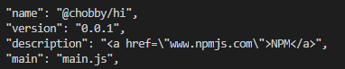
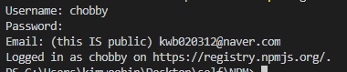
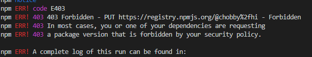
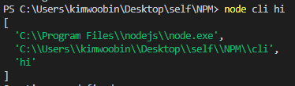
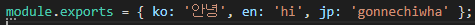

# NPM

<a href="www.npmjs.com">NPM</a>


Node Package Manager 로써 , 필요한 파일을 Publish , Install 할 수 있는 도구이다.



```javascript
npm init
```

을 하게되면 위와같은 옵션들을 설정할 수 있는데
name 의 경우

```javascript
npm install @chobby/hi
```

로 접근할 수 있게 한다는 뜻이며 main 은 내 모듈 패키지의 중심이 될 파일의 이름을 적는 것 이다.

# NPM Publish

npm을 등록하기 위해서는 홈페이지에서 계정을 등록해야한다.

```javascript
npm login
```



정상적으로 처리한다면 해당 로그를 볼 수 있다.



꼭 홈페이지에 들어가서 이메일 인증을 해주어야 위의 에러를 피할 수 있다.

```javascript
npm publish --access public
```

우리의 패키지를 npm에 공개적으로 등록한다
(비공개는 유료이다.)

같은 버전은 등록할 수 없으므로 package.json 의 버전을 항상 수정해주어야 한다.

# 다음버전 배포

```javascript
npm publish
```

다음 버전을 배포할 때 에는 그냥 npm publish 만 해주면 된다.

# 사용자의 입장

```javascript
npm init -y
// npm 의 기본정보들로 package.json 파일을 생성
npm i @chobby/hi
// 내 패키지 다운로드
npm outdated
// 새 버전이 나왔다면 업데이트
```

# Process.Argv

```javascript
node cli hi
```

라고 입력한 경우이다.



1. node 의 위치
2. cli.js 파일의 위치
3. 선언 문자열

즉 process.argv[Number] 로 접근이 가능하다

---



해당 모듈에서

```javascript
const greeting  = require('해당 모듈주소')
// 로 선언한 경우
greeting.ko === greeting['ko']
// 둘은 같은 '안녕' 을 반환하며 이를 통해
------

node cli ko

// 를 greeting[process.argv[2]] 로 받는다면 '안녕' 을 반환한다는 것을 알 수 있다.
```
